<!-- TOC depthFrom:2 depthTo:6 orderedList:false updateOnSave:true withLinks:true -->

- [Before You Begin](#before-you-begin)
- [Configure Verification Server Realm](#configure-verification-server-realm)
    - [Admin User](#admin-user)
    - [Create Realm](#create-realm)
    - [Configure Realm](#configure-realm)
    - [Signing Keys](#signing-keys)
- [Configure the Key Server](#configure-the-key-server)
    - [Connect to the admin console](#connect-to-the-admin-console)
    - [Admission Control](#admission-control)
        - [Create a verification key](#create-a-verification-key)
        - [Create authorized health authority](#create-authorized-health-authority)
    - [Export Configuration](#export-configuration)
        - [Signing key configuration](#signing-key-configuration)
        - [Create export configuration](#create-export-configuration)
- [Follow up](#follow-up)

<!-- /TOC -->

# Application Configuration

Here we explain how to configure both severs for a client application
so that it works end-to-end.

We will assume that the application has been deployed at `exposure-notifications-test.org`, but
you will want to substitute that with the domain name that you have registered for
this purpose. We will also be configuring an application in the fictional jurisdiction of 
_Magrathea_ (with fake ISO code `MAG`).

## Before You Begin

This guide assumes that you have deployed both the 
[key server](https://github.com/google/exposure-notifications-server/) and
[verification server](https://github.com/google/exposure-notifications-verification-server/)
to Google Cloud Platform in our chosen region, in two separate projects.

If you haven't yet deployed the servers, you can follow the deployment guides.

* [key server deployment with terraform](https://github.com/google/exposure-notifications-server/tree/main/terraform)
* [verification server deployment with terraform](https://github.com/google/exposure-notifications-verification-server/tree/main/terraform)

Starting from that point, this will direct you to everything that is needed to
configure a verification server realm, define admission to the key sever,
generate exports, and share a public key for those exports with Apple and Google.

## Configure Verification Server Realm

### Admin User

First, make sure you have [bootstrapped the system](https://github.com/google/exposure-notifications-verification-server/blob/6ddae22d23c33766c4014fd545afeea42ef86de1/docs/production.md#user-administration)
by logging in AND creating an additional system admin account that represents a real user
and deleting the bootstrap (`super@example.com`) account.

### Create Realm

Follow the [verification admin guide](https://github.com/google/exposure-notifications-verification-server/blob/6ddae22d23c33766c4014fd545afeea42ef86de1/docs/system-admin-guide.md#creating-new-realms)
for creating a new realm.

When creating the realm, be sure to:

* select __Create realm specific signing key__
* set the issuer to the reverse DNS of the verification sever + the ISO region code, for example:
    * `org.exposure-notifications-test.mag`
* set the audience to the reverse DNS of the key server, for example:
    * `org.exposure-notifications-test.key`

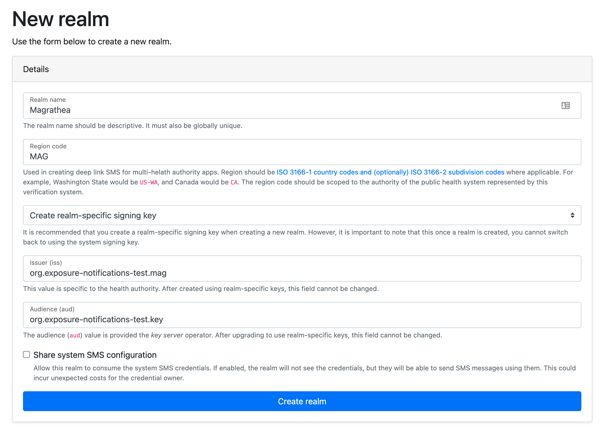

When you create the realm, you will automatically join it.

Go to the realm's settings, and we'll continue the configuration.

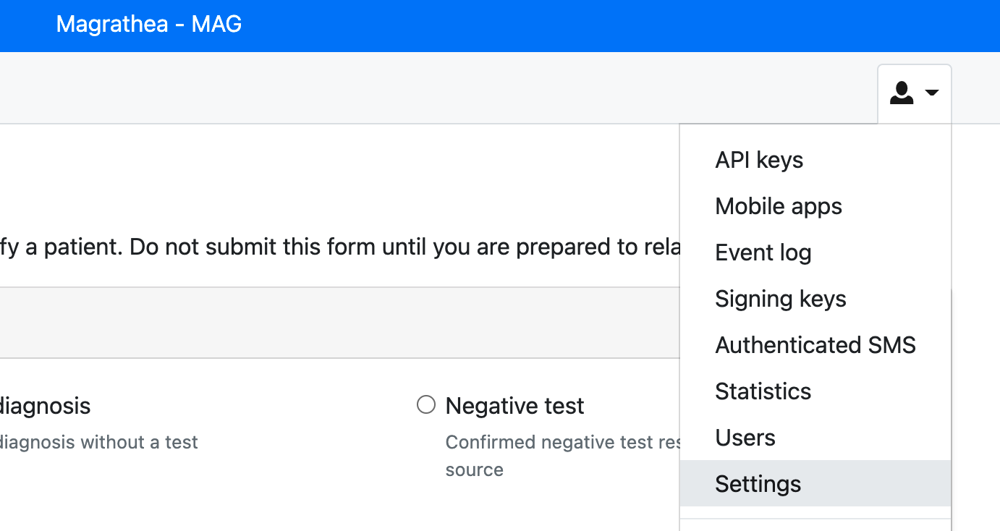

### Configure Realm

These are the recommended settings in tha general realm configuration, you are
free to deviate from this.

* On the __General__ tab
    * Select `Enable key-server statistics`
    * leave everything as as defaults.
* On the __Codes__ tab
    * Set `Bulk issue codes` to `Allow`
    * Set `Allowed test types` to `Positive`
    * Set `Date Configuration` to `Required`
* On the __SMS__ tab [optional]
    * Enter your Twilio credentials  
* On the __Security__ tab
    *  Change `Multi-factor authentication` to `Required`

### Signing Keys

Navigate to the signing keys screen.

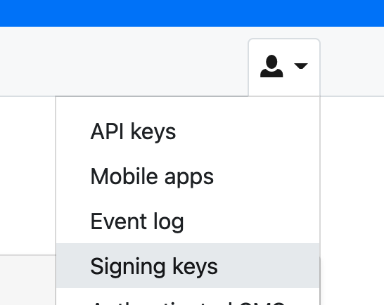

Follow the realm admin guide to enable [automatic rotation](https://github.com/google/exposure-notifications-verification-server/blob/main/docs/realm-admin-guide.md#automatic-rotation)

Click on the `View public discovery` link and note the URL for thw JWKS document.
You will need this URL later.

For this example, our _Magrathea_ URL is `https://exposure-notifications-test.org/jwks/8`

## Configure the Key Server

For this section, you will need to first:

* On your local machine
    * Install the [Google Cloud SDK](https://cloud.google.com/sdk/docs/install)
    * Install [Golang](https://golang.org/)
    * Install [cloud-run-proxy](https://github.com/sethvargo/cloud-run-proxy#cloud-run-proxy)
* Be an owner on the cloud project hosting the key server

### Connect to the admin console

As part of the standard terraform deployment, the key sever has an admin console that
is used to configure the system.

Navigate to the [Google Cloud console](https://console.cloud.google.com/) and select
your key server project.

Navigate to the Cloud Run section and select your `admin-console` service.

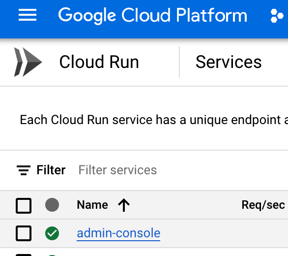

There will be a URL for the admin console (ending in a.run.app). Open a command line
terminal on your laptop/workstation. Log into Google cloud and start
the cloud-run-proxy.

```shell
❯ gcloud auth login && gcloud auth application-default login
❯ cloud-run-proxy --host https://YOUR-SERVICE_URL.a.run.app
127.0.0.1:8080 proxies to https://YOUR-SERVICE_URL.a.run.app
```

Open a browser to http://localhost:8080

### Admission Control

The first step is making sure your application can publish temporary exposure
keys to the key server.

#### Create a verification key

Click on the `New Verification Key` button.

Fill out the form as follows, use the information from earlier steps.

* Name: Locale name
* Issue/Aud/JWKS URI: fields from before. 

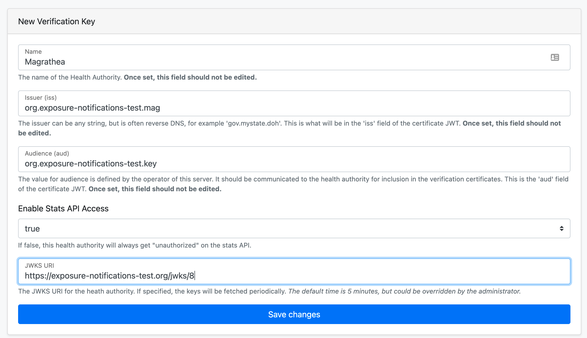

Click 'Save changes' 

If successful, click `Home` in the navigation menu and wait 5 minutes.

Then click into the verification key for your locale and you should
see the public key is now present. For example, this is our public
key after being imported.

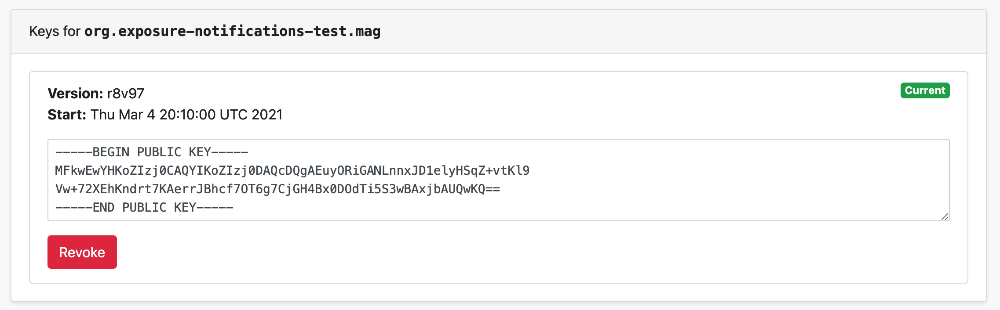

Once confirmed, click `Home` in the navigation menu.

#### Create authorized health authority

Click on the `New Authorized Health Authority` button.

* Enter the health authority ID to be the name of your locale (lowercase)
    * This value is what your application will pass as the `healthAuthorityID`
      for publish requests.
* The region should be the same ISO region entered on the verification server
    * All uploaded keys will be tagged with this region, this is important
      when creating export configurations.      
* `Disable Revision Token Enforcement` MUST BE `false` in production environments.    
* `Disable Health Authority Verification` MUST BE `false` in production environments.
* Select the `Health Authority Certificate` checkbox for the key we just created.

Press the `Save Changes` button when done. And then press `Home` in the navigation
bar.

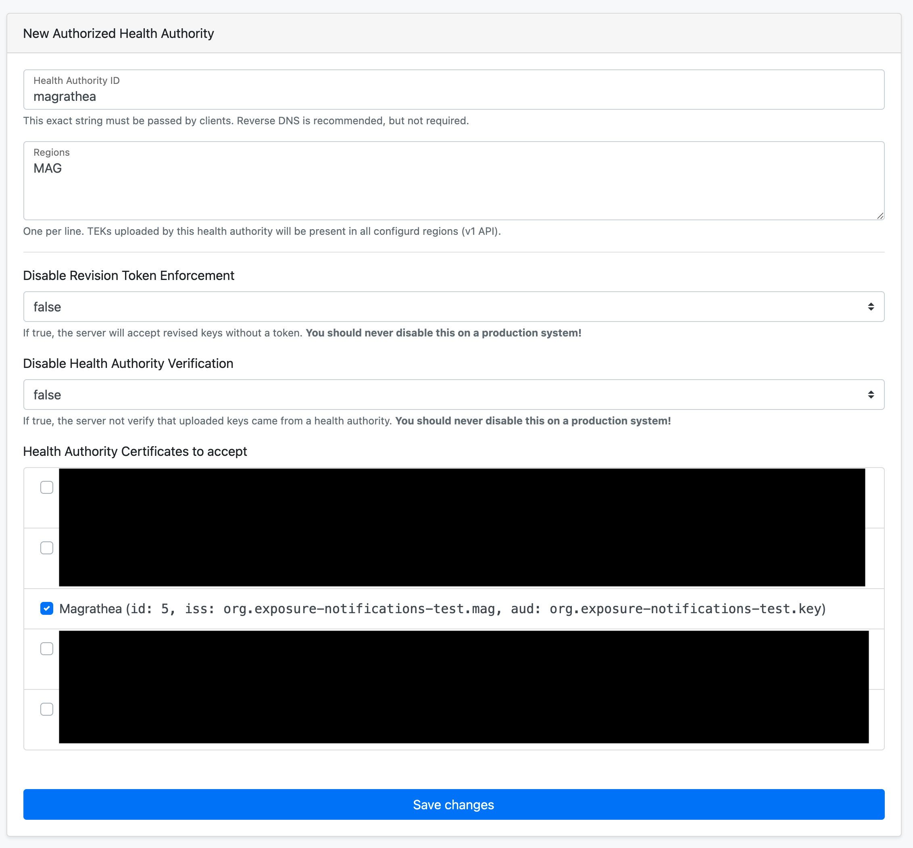

### Export Configuration

The next step is to create an export file for consumption by your application
out in the field. This involves 2 steps, creating and configuring the 
export signing key and then configuring the export.

We will be using both the Google Cloud console and and the key server admin
console (using the cloud-run-proxy from the previous section).

#### Signing key configuration

In the Google cloud console, navigate to `☰` -> `Security` -> `Cryptographic Keys`.

Here you will seen a keyring called `export-signing` that was created as part
of the server deployment. Click on the name of the key ring to view the keys.

As part of the deployment, there is a key created called `signer`. You are free
to use this as your signing key or create a new one. If you create a new key
it must be an asymmetric signing key if type `Elliptic Curve P-256 key SHA256 Digest`.
The use of `HSM` level protection is recommended, but not required.

Click into the key that you are using.

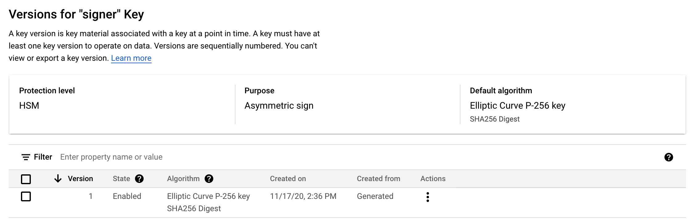

Click the 3 dots menu and select copy resource name.

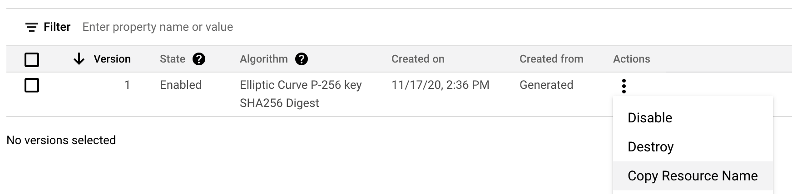

It will be of the form
`projects/PROJECT-ID/locations/REGION/keyRings/export-signing/cryptoKeys/KEY-NAME/cryptoKeyVersions/1`.
You will need this value later.

Under that same menu, you will see the `Get Public Key` option. Use that option
to get the public key that needs to be shared with Apple/Google.

Change over to the admin console, which should still be at
[localhost:8080](https://localhost:8080).

Press the `Create New Signature Info` button and fill out the form

* Signing Key: the full resource name of the key version we copied earlier
* Signing Key ID: the [MCC](https://en.wikipedia.org/wiki/Mobile_country_code) code for your country
* Signing Key Version: Any value, typically `v1`

Press `save changes` and once created, press `Home` in the navigation menu.

For Apple/Google to activate your public key on devices, you need these pieces of information, the:

* KeyID
* KeyVersion
* Public Key in PEM format, for example
```
-----BEGIN PUBLIC KEY-----
MFkwEwYHKoZIzj0CAQYIKoZIzj0DAQcDQgAEpKJ5cMAxnYzPS70SSjNug/ToJ840
jUYCYP+f8hRT9qIsBTFXkAQ4mKVeivRJJvbCi+QMCSh9W2yvX46SbgXGvQ==
-----END PUBLIC KEY-----
```

#### Create export configuration

Back on the Google Cloud console, we need to find the cloud storage bucket
that is used for your deployment. Navigate to `☰` -> `Storage` -> `Browser`.

You will see a bucket where the name starts with `exposure-notifications-export-`,
copy the full bucket name, you will need it to configure the export.

Move back to the key server admin console. Press the
`Create new Export Config` button, and fill out the form:

* Output region, your ISO region used before
* Input region, same, your ISO region
* Include travelers, set to `No` if this is a single tenant server,
  otherwise `Yes` is recommended
* Cloud Storage bucket, fill in with the value we discovered earlier.

Example:

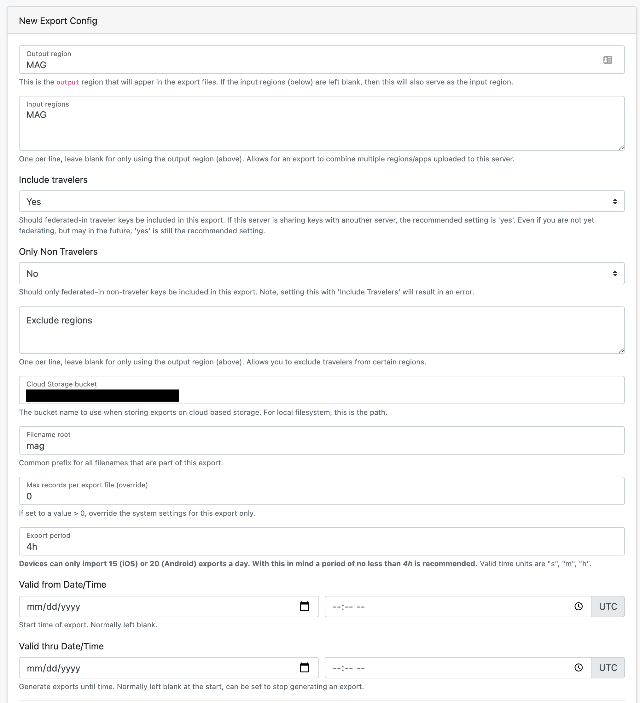

In the lower half of the form, select the signing key that we just configured.
This will ensure that your exports are correctly signed.

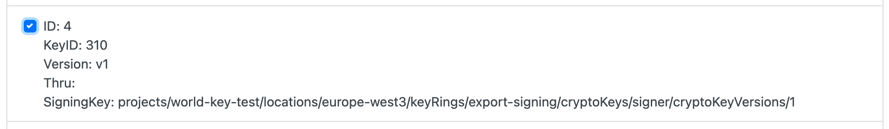

This will make the export files available at

* `https://export.key.YOURDOMAIN/REGION/index.txt`

In our example, this is 

* `https://export.key.exposure-notifications-test.org/mag/index.txt`

Please see the [key processing guide](https://google.github.io/exposure-notifications-server/getting-started/downloading-export-batches-keys)
for information on how to download export files.

This completes the the server configurations.

## Follow up

Your application will need to know the correct URLs for the verification
server APIs and key server publish APIs. In our example domains, the following
URLs are relevant.

* verify API: `https://apiserver.exposure-notifications-test.org/api/verify`
* certificate API: `https://apiserver.exposure-notifications-test.org/api/certificate`
* publish API: `https://exposure.key.exposure-notifications-test.org/v1/publish`

For export files to be successfully processed, the export signing key information needs
to be shared with both Apple and Google.
