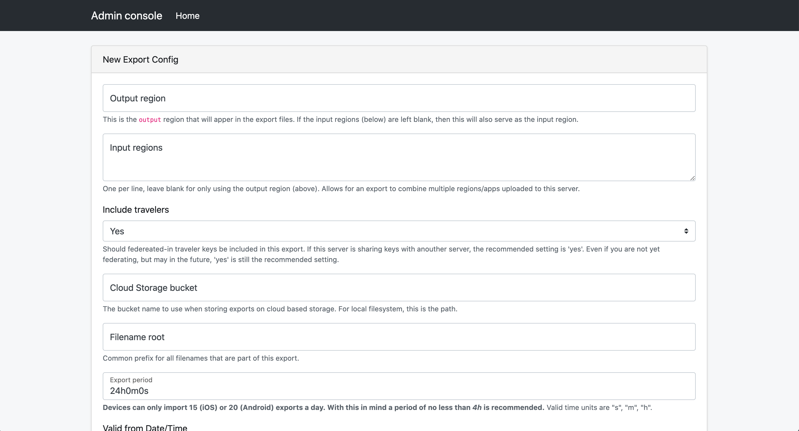
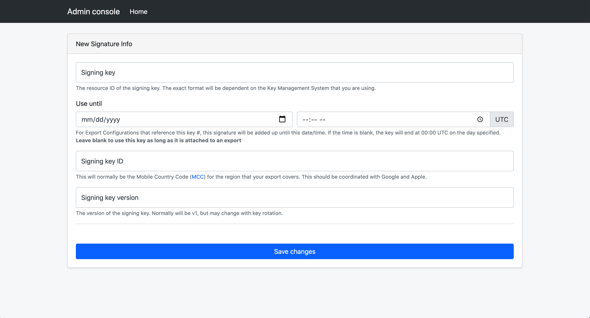

# Temporary Exposure Key (TEK) Downloading via Batches

This page explains how to retrieve published temporary exposure keys (TEKs)
from the server by generating batches that can be downloaded by a mobile
application. These batches are logical groupings of TEKs published to the
server. Keys can be grouped by region and the frequency of batching is
configurable. We recommend batches are configured to be generated at most every
4 hours, with a likely time being somewhere between 4 and 24 hours.

# Consuming Export Batches

## Index File Structure

The index.txt file indicates which export files are available for a mobile device
to consume. The index file contains relative path names for available archives.
A client is typically given two configuration items for pointing at a server

* The absolute location of the index.txt file
* The absolute base path to which the relative data in the index file should be appended

As an example. If an index file is located at `https://cdn.example.com/24h/region/index.txt`
and the export base path of `https://cdn.example.com/24h/` and the contents of the index
file are:

```
region/file1.zip
region/file21.zip
region/other_export_.zip
```

Then the following 3 archives are are being offered to clients:

1. `https://cdn.example.com/24h/region/file1.zip`
1. `https://cdn.example.com/24h/region/file21.zip`
1. `https://cdn.example.com/24h/region/other_export_.zip`

And these are being arrived at by appending the contents of the index file (one per line)
to the base path provided by the server operator.

### Index Processing Guideliens

* Do not make any assumptions or dependencies on the layout of the .zip filenames themselves.
* Do not make any assumptions about the depth of the ralative path in the index file. 
* The index.txt will always be ordered from oldest file to newest file.
* Each file only needs to be processed once.

There are two modes of index file processing that meet these guidelines.

#### Last seen method (most common):

The most common method (in use by the Android reference application) is for the client
to remember the last filename that it has seen in an index.txt file.

On next processing, if that line is seen in the file, the application will process
from the next file to the end of the index. If that lien is not present in the file,
then the application will restart processing of the index from the beginning (line 0).

When done, the application always remembers the last filename processed.

#### Set method:

The client application should treate absolute URLs of the exports indicated in the the
index.txt file contents as a set. The client should store the previsuly known state in
local storage.

If differences are seen, the clients should download the items missing from the set in top
to bottom order (oldest to newest) and hand them to the operating system for matching.

The new set of absolute URLs should then be retained for processing next time around.

## Export File Concepts

As the protocol has changed over the deployment of various exposure notifications
installations, we have made a decisions to drop the usage of a batch
being split across multiple files, and show all batches as single file size only.
This reduces the possilibty that a client app will pass un-parsable batch files
to the operating system.

Practically speaking: currently all export files produced by this system will have
`batchNum` of `1` and `batchSize` of `1`. In the event a time period is too 
large to find in one file according to the max records setting, there will
be multiple files with the same `startTimestamp` but different `endTimestamps`. This
is done to ensure successful processing based on how both iOS and Android
handle export processing.

# Configurating Export Batches

## Prerequisites



## Downloading TEKs

In order to download the exposure keys from the exposure notification key server, the first
step is to configure exports from the server.

To add these entries, we can use the Admin Console. For instructions on how to
launch the console, you can view the
[deployment documentation](deploying#configuring-the-server).

Once the admin console is launched, you will see a few choices presented.


Select "Create new Export Config"



Creating an export config will generate export files (batches of keys) that are produced on a
defined schedule. These will be available for download via the configured
storage and/or CDN and downloadable by devices. CDN configuration is external
to this server. Most Cloud Providers have a CDN solution that you can leverage.

It is also required that you create a signing key that will be used to sign
the export files. This ensures that the batches of keys devices receive are
originating from the server and not an unauthorized, potentially malicious,
third-party. The signing key must be an asymmetric ECDSA P-256 key, and the
public portion must be shared with Google and Apple. If the
signing key is invalid, or if the key is not shared with Google and Apple, the
Exposure Notification API will not invoke matching on the export.


