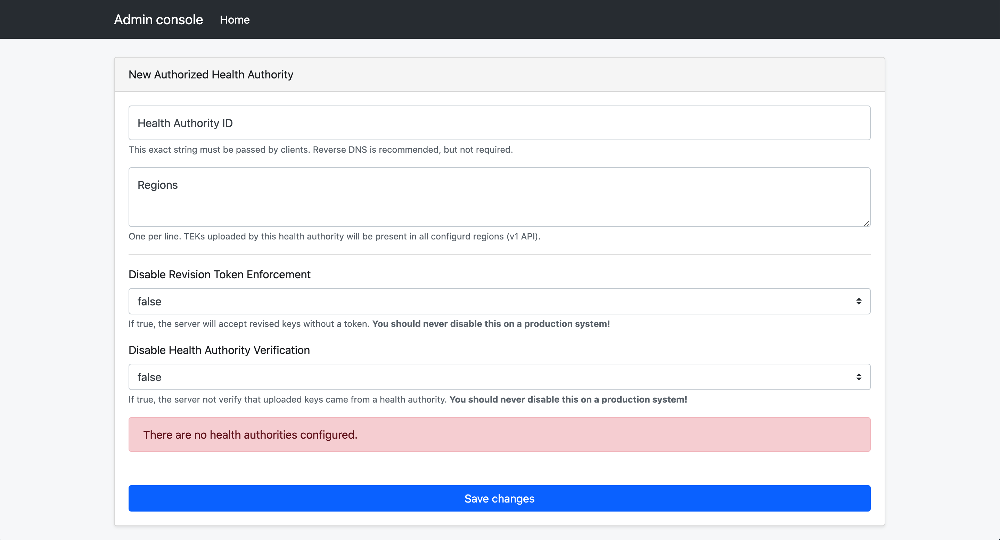

# Temporary Exposure Key (TEK) Publishing Guide

This page explains how to configure the server and application to allow
publishing keys from mobile applications to the server.

## Prerequisites



## What is a Temporary Exposure Key?
Temporary Exposure Keys, or TEKs, are anonymous keys shared between mobile
devices to determine if two devices were sufficiently nearby to be considered
"exposed" to one another. When an application user confirms they have been
exposed, their keys are shared to the server in order for applications to
download and [determine if other users interacted with any of the now exposed
keys](https://blog.google/documents/69/Exposure_Notification_-_Cryptography_Specification_v1.2.1.pdf).

## Publishing Keys

In order for your application to publish keys to the server, the server
requires the registration of the Application Name (for Android) or the Bundle ID
(for iOS). This can be done via the admin interface.

To add these entries, we can use the Admin Console Application. For
instructions on how to launch the console, you can view the
[deployment documentation](deploying#configuring-the-server).

Once the Admin Console is launched, you will see a few choices presented.

In the Admin Console, select "Create new Authorized Application"

You are required to provide the App Package Name and/or Bundle ID that will be
publishing to the server. You can optionally configure a limited set of regions
that will be accepted. This region is included as part of the publish payload.
While it is expected this is likely a Country, State, or Provice Code, the
string is opaque to the server. You can use this to delineate any boundary you
find useful. These regions used on upload are used at export time. Each Export
Configuration can be comprised of one or more region codes. This provides
flexibility in how the keys are grouped and distributed to mobile apps.

Optionally you can also disable Health Authority Verification. This is not
recommended as it would allow wide-access publishing of temporary exposure
keys. To configure a health authority, you can select the configuration page
from the main landing page of the Admin Console.

For more information on creating a verification server, see the design for a
[configurable third-party verification service](design/verification_protocol.md)
