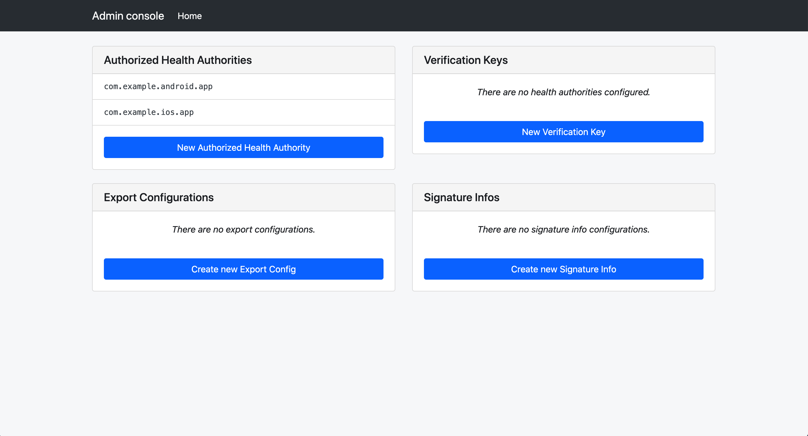

# Temporary Exposure Key (TEK) Retrieval via Batches

This page explains how to retrieve publihsed temporary exposure keys (TEKs)
from the server by generating batches that can be downloaded by a mobile
application. These batches are logical groupings of TEKs published to the
server. Keys can be grouped by region and the frequency of batching is
configurable. We recommend batches are configured to be generated at most every
4 hours, with a likely time being somewhere between 4 and 24 hours.

## Prerequisites



## Retrieving Keys

In order to retrieve keys from the exposure notifications server, the first
step is to configure exports from the server.

To add these entries, we can use the Admin Console. For instructions on how to
launch the console, you can view the
[deployment documentation](/getting-started/deploying#configuring-the-server).

Once the admin console is launched, you will see a few choices presented.

Select "Create new Export Config"

Creating an export config will generate batches that are produced on a
defined schedule. These will be available for download via the configured
storage and/or CDN and downloadable by devices. CDN configuration is external
to this server. Most Cloud Providers have a CDN solution that you can leverage.

It is also required that you create a key that can be used to sign these
batches. This helps to ensure that the batches devices are receiving are
originating from the server and not an unauthorized, potentially malicious,
third-party. The signing key must be an asymmetric ECDSA P-256 key, and the
public portion must be shared with Google and Apple. If the
key is invalid, or if the key is not shared with Google and Apple, the mobile
operating system will refuse to import your export data.

