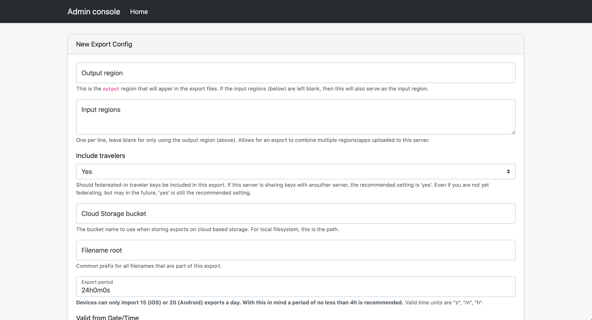
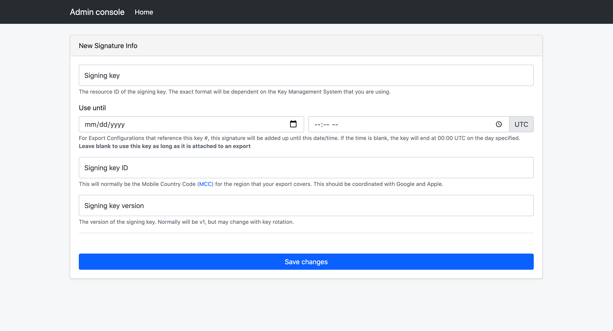

# Key Retrieval Guide

This page explains how to retrieve keys from the server via a mobile application

## Prerequisites

If you haven't started developing a mobile app, please take a look at the
[Android Exposure Notifications Reference App](https://github.com/google/exposure-notifications-android)

You will need to
[complete the necessary steps](https://support.google.com/googleplay/android-developer/contact/expo_notif_api)
to use the exposure notifcations API. You should also ensure that you have
taken the steps to comply with the
[Terms of Service](https://blog.google/documents/72/Exposure_Notifications_Service_Additional_Terms.pdf).
For instance, your app may not request any of the following permissions:
  * ACCESS_FINE_LOCATION
  * ACCESS_COARSE_LOCATION
  * ACCESS_BACKGROUND_LOCATION
  * BLUETOOTH_ADMIN

## Retrieving Keys

In order to retrieve keys from the exposure notifications server, the first
step is to configure exports from the server.

To add these entries, we can use the admin-console. For instructions on how to
launch the console, you can view the
[deployment documentation](/getting-started/deploying#configuring-the-server).

Once the admin console is launched, you will see a few choices presented.

Select "Create new Export Config"

Creating an export config will generate batches that are produced on a schedule. These will be available for download via the CDN.

It is also recommended that you create a key that can be used to sign these batches. This helps to ensure that the batches devices are receiving are originating from the server.

