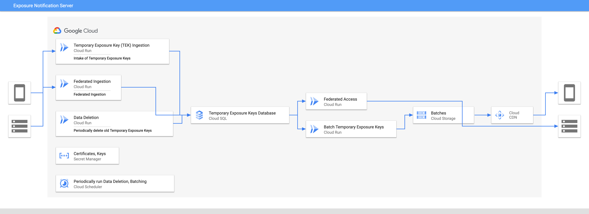

# Google Exposure Notification Server

## Server deployment options

This document describes possible strategies for building and hosting the
Exposure Notification Server components. You should use this information
explore and compare trade-offs when making hosting decisions.

We have outlined a number of options, ranging from an entirely
self-hosted service to a fully managed Google Cloud deployment. The BLE
Proximity Notifications Server architecture can be deployed in the
following environments:

* Fully self-hosted or on-premises
* Fully managed Google Cloud
* A combination of self-hosted and fully managed

For more details on each
component, see the [Server Functional Requirements](server_functional_requirements.md).

## Server architecture

The Exposure Notification Server has multiple components which can be
categorized as compute and data. To understand deployment scenarios, you should
look at the architecture of the server and the task each component is
responsible for.

//TODO: GCP logos have to be removed from the following two diagrams.

The compute components are a good candidate for deployment on
[serverless architectures](https://en.wikipedia.org/wiki/Serverless_computing).

The request load is uneven throughout the day, likely scaling down to zero if
the deployment only covers a single or small number of countries. Likewise,
the server should scale up to meet peak demand during the day.

Each of these components can be deployed in a “serverless” way where the
services themselves are stateless, easily scaling and relying on data stored
in a shared database.

## Server components

//TODO(llatif): The component/service names must match the diagram

<table>
  <tr>
   <td>
   </td>
   <td><strong>Purpose</strong>
   </td>
   <td><strong>Fully Hosted Google Cloud</strong>
   </td>
   <td><strong>Self-hosted, Google-managed</strong>
   </td>
   <td><strong>Self Hosted Kubernetes</strong>
   </td>
  </tr>
  <tr>
   <td><strong>Database</strong>
   </td>
   <td>Stores anonymized exposure keys from devices identified as exposed
   </td>
   <td><a href="https://cloud.google.com/sql/">Google Cloud SQL (PostgreSQL)</a>
   </td>
   <td>PostgreSQL hosted with on-prem Kubernetes
   </td>
   <td>PostgreSQL on Kubernetes 
   </td>
  </tr>
  <tr>
   <td><strong>Key Batch CDN</strong>
   </td>
   <td>Daily batches of database for client use.
   </td>
   <td><a href="https://cloud.google.com/cdn/">Google Cloud CDN</a>
   </td>
   <td>Third Party CDN, Redis + Server, or allow direct access to storage
   </td>
   <td>Third Party CDN, Redis + Server, or allow direct access to storage
   </td>
  </tr>
  <tr>
   <td><strong>Key Batch Storage</strong>
   </td>
   <td>Daily batches of database for client use.
   </td>
   <td><a href="https://cloud.google.com/storage/">Google Cloud Storage</a>
   </td>
   <td>Open Source Blobstore hosted with on-prem Kubernetes
   </td>
   <td>Kubernetes hosted Open Source Blobstore (ie. min.io, rook). Could also use Redis and reconstruct batches
   </td>
  </tr>
  <tr>
   <td><strong>Secret Management</strong>
   </td>
   <td>Secure Storage for secrets such as signing, private keys, etc.
   </td>
   <td><a href="https://cloud.google.com/secret-manager">Secret Manager</a>
   </td>
   <td><a href="https://cloud.google.com/anthos">Anthos GKE on Prem</a> + KMS 
   </td>
   <td>HashiCorp Vault 
   </td>
  </tr>
  <tr>
   <td><strong>Exposure Ingestion API Server</strong>
   </td>
   <td>Ingestion of exposure keys from android devices. 

Could be extended for cancellation.
   </td>
   <td><a href="https://cloud.google.com/run/">Google Cloud Run</a>
   </td>
   <td>On-prem Kubernetes with Cloud Run for <a href="https://cloud.google.com/anthos">Anthos GKE on-prem</a>
   </td>
   <td>Kubernetes with Knative Serving
   </td>
  </tr>
  <tr>
   <td><strong>Exposure Reporting Server</strong>
   </td>
   <td>Serves infected keys to users
   </td>
   <td><a href="https://cloud.google.com/storage/">Google Cloud Storage</a> + <a href="https://cloud.google.com/cdn">Google Cloud CDN</a>
   </td>
   <td>On-prem Kubernetes with <a href="https://cloud.google.com/anthos">Anthos GKE on-prem</a>, Or Google Cloud CDN
   </td>
   <td>Kubernetes with Knative Serving + Redis
   </td>
  </tr>
  <tr>
   <td><strong>Exposure Data Deletion</strong>
   </td>
   <td>Removal of data older than a configurable time, for instance 14D
   </td>
   <td><a href="https://cloud.google.com/run/">Google Cloud Run</a>
   </td>
   <td>On-prem Kubernetes with <a href="https://cloud.google.com/anthos">Anthos GKE on-prem</a>
   </td>
   <td>Kubernetes, either job or Knative Service 
   </td>
  </tr>
  <tr>
   <td><strong>Batch Pushes to Storage/CDN</strong>
   </td>
   <td>Periodic DB queries to batch data for client consumption.
       Signs payloads for verification on device.
   </td>
   <td><a href="https://cloud.google.com/run/">Google Cloud Run</a>
   </td>
   <td>On-prem Kubernetes with <a href="https://cloud.google.com/anthos">Anthos GKE on-prem</a>
   </td>
   <td>Kubernetes, either job or Knative Service
   </td>
  </tr>
  <tr>
   <td><strong>Job Scheduling</strong>
   </td>
   <td>Used to control running of periodic jobs (deletion, batching)
   </td>
   <td><a href="https://cloud.google.com/scheduler">Google Cloud Scheduler</a>
   </td>
   <td>Kubernetes Cronjobs
   </td>
   <td>Kubernetes Cronjobs
   </td>
  </tr>
  <tr>
    <td colspan="5">
    <strong>Optional components</strong>
    </td>
  </tr>
  <tr>
   <td><strong>Federated Ingestion</strong>
   </td>
   <td>Ingestion of keys from other parties.
   </td>
   <td><a href="https://cloud.google.com/run">Google Cloud Run</a>
   </td>
   <td>On-prem Kubernetes with <a href="https://cloud.google.com/anthos">Anthos GKE on-prem</a>
   </td>
   <td>Kubernetes with Knative Serving
   </td>
  </tr>
  <tr>
   <td><strong>Federated Sharing</strong>
   </td>
   <td>Allows other parties/countries to retrieve data
   </td>
   <td><a href="https://cloud.google.com/run">Google Cloud Run</a>
   </td>
   <td>On-prem Kubernetes with <a href="https://cloud.google.com/anthos">Anthos GKE on-prem</a>
   </td>
   <td>Kubernetes with Knative Serving
   </td>
  </tr>
</table>

## Hosting infrastructure options

### Data and compute hosted on premises

This example deployment uses an on-premises Google Kubernetes Engine cluster.
Such a deployment allows you to have complete control of all components in
and deploy them in any location. However, this deployment will require you to
configure and maintain the underlying infrastructure, and ensure it is able to
meet usage demands.

When the Exposure Notification Server is deployed on-premises, we recommend you
deploy audit and access logging to the data and API endpoints. This is
automatically available in the fully managed, and hybrid deployment scenarios.

### Self-hosted, Google-managed hybrid

Data hosted on premises with compute hosted on Google Cloud

There is flexibility for how you combine on-premise and cloud-only solutions. For this example, let’s assume all serverless functions would be hosted on Google Cloud, with databases hosted on premise.

Note: while not pictured, you can also consider a similar solution, where the processing happens on an [Anthos](https://cloud.google.com/anthos/) cluster on-premise and the data is stored in Google Cloud as a fully managed service.

### Fully hosted on Google Cloud

This example deployment hosts all components of the system on Google Cloud.
By using fully hosted components much of the service’s operation can be delegated to Google Cloud and provide auditing of access to data. For example, Hosted Postgres delegates upgrades and patching of the database to Google Cloud. 

This solution requires hosting within a [Google Cloud location](https://cloud.google.com/about/locations) which may not exist in a location that permits use for all aspects of the design. For instance, within the EU, components could host compute resources in Belgium, Netherlands, or Finland. Data could be hosted in London, Belgium, Netherlands, Zurich, Frankfurt, or Finland.
