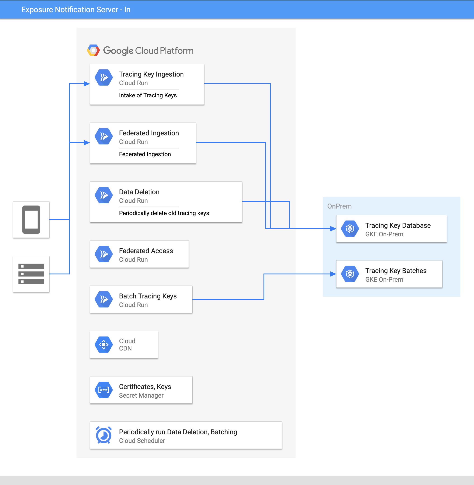
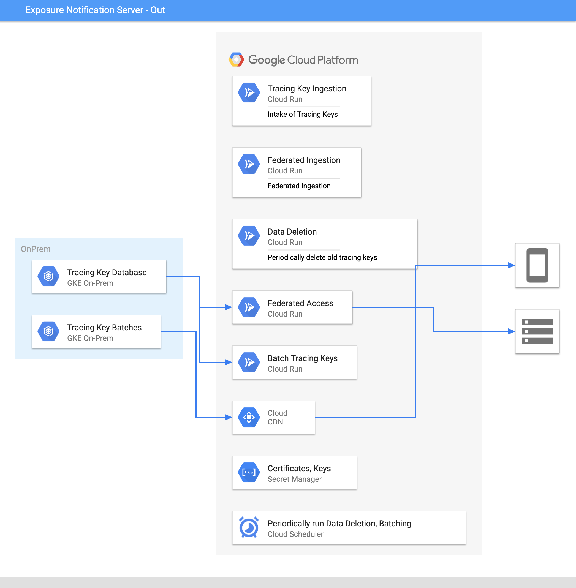

# Google Exposure Notification Server

## Server deployment options

This document describes possible strategies for building and hosting the
Exposure Notification Server components. You should use this information
explore and compare trade-offs when making hosting decisions.

We have outlined a number of options, ranging from an entirely
self-hosted service to a fully managed Google Cloud deployment. The BLE
Proximity Notifications Server architecture can be deployed in the
following environments:

* Fully self-hosted or on-premises
* Fully managed Google Cloud
* A combination of self-hosted and fully managed

For more details on each
component, see the [Server Functional Requirements](server_functional_requirements.md).

## Server architecture

The Exposure Notification Server has multiple components which can be
categorized as compute and data. To understand deployment scenarios, you should
look at the architecture of the server and data flow between servers and
devices.

The compute components are a good candidate for deployment on
[serverless architectures](https://en.wikipedia.org/wiki/Serverless_computing).

Since the request load is uneven throughout the day, likely scaling down to
zero if the deployment only covers a single or small number of countries.
Likewise, the server should scale up to meet peak demand during the day.

Each of these components can be deployed in a “serverless” way where the
services themselves are stateless, easily scaling and relying on data stored
in a shared database.

## Server components

<table>
  <tr>
   <td>
   </td>
   <td><strong>Purpose</strong>
   </td>
   <td><strong>Fully Hosted Google Cloud</strong>
   </td>
   <td><strong>Self-hosted, Google-managed</strong>
   </td>
   <td><strong>Self Hosted Kubernetes</strong>
   </td>
  </tr>
  <tr>
    <td colspan="5">
    <strong>Data components</strong>
    </td>
  </tr>
  <tr>
   <td><strong>Tracing key database</strong>
   </td>
   <td>Stores anonymized exposure keys from devices identified as exposed
   </td>
   <td><a href="https://cloud.google.com/sql/">Google Cloud SQL (PostgreSQL)</a>
   </td>
   <td>PostgreSQL hosted with on-prem Kubernetes
   </td>
   <td>PostgreSQL on Kubernetes
   </td>
  </tr>
  <tr>
   <td><strong>Tracing key batches storage</strong>
   </td>
   <td>Daily batches of database for client use.
   </td>
   <td><a href="https://cloud.google.com/storage/">Google Cloud Storage</a>
   </td>
   <td>Open Source Blobstore hosted with on-prem Kubernetes
   </td>
   <td>Kubernetes hosted Open Source Blobstore (ie. min.io, rook). Could also use Redis and reconstruct batches
   </td>
  </tr>
  <tr>
   <td><strong>Certificate and key storage</strong>
   </td>
   <td>Secure Storage for secrets such as signing, private keys, etc.
   </td>
   <td><a href="https://cloud.google.com/secret-manager">Secret Manager</a>
   </td>
   <td><a href="https://cloud.google.com/anthos">Anthos GKE on Prem</a> + KMS 
   </td>
   <td>HashiCorp Vault 
   </td>
  </tr>
  <tr>
    <td colspan="5">
    <strong>Compute components</strong>
    </td>
  </tr>
  <tr>
   <td><strong>Tracing key ingestion server</strong>
   </td>
   <td>Ingestion of exposure keys from client devices.
   </td>
   <td><a href="https://cloud.google.com/run/">Google Cloud Run</a>
   </td>
   <td>On-prem Kubernetes with Cloud Run for <a href="https://cloud.google.com/anthos">Anthos GKE on-prem</a>
   </td>
   <td>Kubernetes with Knative Serving
   </td>
  </tr>
  <tr>
   <td><strong>Exposure Reporting Server</strong>
   </td>
   <td>Serves anonymous keys of exposed users
   </td>
   <td><a href="https://cloud.google.com/storage/">Google Cloud Storage</a> + <a href="https://cloud.google.com/cdn">Google Cloud CDN</a>
   </td>
   <td>On-prem Kubernetes with <a href="https://cloud.google.com/anthos">Anthos GKE on-prem</a>, Or Google Cloud CDN
   </td>
   <td>Kubernetes with Knative Serving + Redis
   </td>
  </tr>
  <tr>
   <td><strong>Data deletion</strong>
   </td>
   <td>Deletion of data that is older than a configured time limit.
   </td>
   <td><a href="https://cloud.google.com/run/">Google Cloud Run</a>
   </td>
   <td>On-prem Kubernetes with <a href="https://cloud.google.com/anthos">Anthos GKE on-prem</a>
   </td>
   <td>Kubernetes, either a job or Knative Service
   </td>
  </tr>
  <tr>
   <td><strong>Batch tracing keys</strong>
   </td>
   <td>Periodic DB queries to batch data for client consumption.
       Signing payloads for verification on device.
   </td>
   <td><a href="https://cloud.google.com/run/">Google Cloud Run</a>
   </td>
   <td>On-prem Kubernetes with <a href="https://cloud.google.com/anthos">Anthos GKE on-prem</a>
   </td>
   <td>Kubernetes, either job or Knative Service
   </td>
  </tr>
  <tr>
   <td><strong>Periodic data batching and deletion</strong>
   </td>
   <td>Used to control running of periodic jobs (deletion, batching)
   </td>
   <td><a href="https://cloud.google.com/scheduler">Google Cloud Scheduler</a>
   </td>
   <td>Kubernetes Cronjobs
   </td>
   <td>Kubernetes Cronjobs
   </td>
  </tr>
  <tr>
   <td><strong>Content delivery network</strong>
   </td>
   <td>Distribution of keys to client devices
   </td>
   <td><a href="https://cloud.google.com/cdn/">Google Cloud CDN</a>
   </td>
   <td>Third Party CDN, Redis + Server, or allow direct access to storage
   </td>
   <td>Third Party CDN, Redis + Server, or allow direct access to storage
   </td>
  </tr>
  <tr>
    <td colspan="5">
    <strong>Optional components</strong>
    </td>
  </tr>
  <tr>
   <td><strong>Federated ingestion</strong>
   </td>
   <td>Ingestion of keys from other parties.
   </td>
   <td><a href="https://cloud.google.com/run">Google Cloud Run</a>
   </td>
   <td>On-prem Kubernetes with <a href="https://cloud.google.com/anthos">Anthos GKE on-prem</a>
   </td>
   <td>Kubernetes with Knative Serving
   </td>
  </tr>
  <tr>
   <td><strong>Federated acesss</strong>
   </td>
   <td>Allows other parties/countries to retrieve data
   </td>
   <td><a href="https://cloud.google.com/run">Google Cloud Run</a>
   </td>
   <td>On-prem Kubernetes with <a href="https://cloud.google.com/anthos">Anthos GKE on-prem</a>
   </td>
   <td>Kubernetes with Knative Serving
   </td>
  </tr>
</table>

## Hosting infrastructure options

### Data and compute hosted on premises

This deployment allows you to have complete control of all components in
and deploy them in any location by using an on-premises Google Kubernetes
Engine cluster. However, this deployment will require you to
configure and maintain the underlying infrastructure, and ensure it is able to
meet usage demands.

When the Exposure Notification Server is deployed on-premises, we recommend you
deploy audit and access logging to the data and API endpoints. This is
automatically available in the fully managed, and hybrid deployment scenarios.

### Storing data on-premises and using Google-managed compute

The Exposure Notification Server architecture allows for flexibility in how you
combine on-premises and cloud-based components. This example deployment has
compute components running on Google Cloud Serverless products, with databases
hosted on-premises.

You can use an [Anthos](https://cloud.google.com/anthos/) cluster to host
compute components on premises, and have the data components hosted on Google
Cloud as a fully managed service.

### Fully hosted on Google Cloud

This example deployment hosts all components of the system on Google Cloud.

By using fully hosted components most of the service’s operation can be
delegated to Google Cloud, which will provide audit and access logging of the
data. For example, Cloud SQL will manage the infrastructure for a hosted
PostgreSQL database.

This solution requires hosting within a
[Google Cloud location](https://cloud.google.com/about/locations) which may not
exist in a location that permits use for all parts of the Exposure
Notification Server architecture.