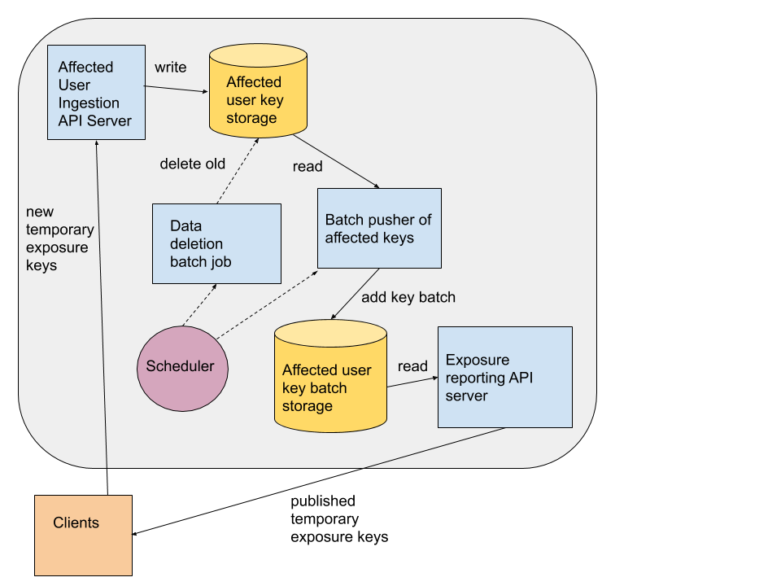

# Google Exposure Notifications Server - Functional Requirements
Here we provide the functional requirements for deploying an exposure notification server.

Created: 2020-04-22

Updated: 2020-05-09


## Objective

This document presents the functional requirements for building a server for powering decentralized exposure notifications. For possible ways of deploying, please view the [Server Deployment Options](server_deployment_options.md).


The server components are responsible for the following functions:


*   Accepting the temporary exposure keys of positively diagnosed users from mobile devices, validating those keys via device attestation APIs, and storing those keys in a database.
*   Periodically, generating incremental files for download by client devices for performing the key matching algorithm (all key matching happens on the mobile devices, not on the server). These incremental files must be digitally signed with a private key. The corresponding public key is pushed to mobile devices via separate configuration.
    *   Recommended: serving these files from a CDN
*   Recommended: periodically deleting old temporary exposure keys. After 14 days (or configurable different time periods) they can no longer be matched to devices.

The server components are a good candidate for deployment on [serverless architectures](https://en.wikipedia.org/wiki/Serverless_computing). The request load is uneven throughout the day, likely scaling down to zero if the deployment only covers a single or small number of countries. Likewise, the server should scale up to meet peak demand during the day. Each of these components can be deployed in a “serverless” way where the services themselves are stateless, easily scaling and relying on data stored in a shared database.

There are some additional required and recommended dependencies:


*   Required: A database for storage of published diagnosis keys.
*   Required: A key/secret management system for storage of API keys, other authorization credentials (CDN for example), and private keys for signing device download content.
*   Recommended: Content Distribution Network (CDN) for distributing the temporary exposure keys of affected users to mobile devices.


## System Components




### Publish Temporary Exposure Keys

When a user reports a diagnosis, it is reported using the publish API server. The specific protocol or encoding doesn’t matter, for reference we are providing a JSON over HTTPS API to show the required data fields. A given mobile application and server pair could agree upon additional information to be shared. The information described in this section is the minimum required set in order to validate the uploads and to generate the necessary client batches for ingestion into the device for key matching.

Minimum required fields, followed by a JSON example:


*   temporaryExposureKeys
    *   Type: Array of TemporaryExposureKey JSON objects
    *   Description: The verified temporary exposure keys 
    *   Constraints:
        *   REQUIRED: contain at least 1 TracingKey objects (below)
        *   OPTIONAL: contain up to 14 (or more if an application is keeping longer history) TracingKey objects.
    *   TemporaryExposureKey Object properties
        *   keyData
            *   Type: String
            *   Description: Base64 encoded temporary exposure key from the device
            *   Constraints
                *   REQUIRED
        *   rollingStartNumber
            *   Type: integer (uint32)
            *   Description: Intervals are 10 minute increments since the UTC epoch
            *   Constraints
                *   REQUIRED
        *   rollingPeriod
            *   Type: integer (uint32)
            *   Description: Number of intervals that the key is valid for
            *   Constraints
                *   OPTIONAL (may not be present for some keys)
                *   Valid values are [1..144]
                *   If not present, 144 is the default value (1 day of intervals)
*   regions:
    *   Type: Array of string
    *   Description: 2 letter country code a.k.a [ISO 3166 alpha-2](https://en.wikipedia.org/wiki/ISO_3166-1_alpha-2) 
        *   _It is possible for a server operator to maintain a more fine grained definition of region or use different identifiers altogether._
    *   **Required for federation between regions.**
*   platform
    *   Type: string
    *   Description: Mobile device platform, i.e. “ios” or “android” used to indicate which device attestation verification APIs should be used.
*   transmissionRisk: 
    *   Type: Integer
    *   **The values and meanings of this enum are not finalized at this time.**
    *   Constraints:
        *   REQUIRED
        *   Valid values range from 1-9
*   deviceVerificationPayload
    *   Type: String
    *   Description:
        *   Verification payload.
        *   In the Android case, this is a SafetyNet device attestation (see below).
            *   JSON Web Signature (JWS) format.
        *   In the iOS case, this is a DeviceCheck attestation (see below).
    *   Constraints:
        *   REQUIRED

Example additional fields that an application might want to collect:


*   regions:
    *   Type: Array of string
    *   Description: 2 letter country code a.k.a [ISO 3166 alpha-2](https://en.wikipedia.org/wiki/ISO_3166-1_alpha-2) 
        *   _It is possible for a server operator to maintain a more fine grained definition of region or use different identifiers altogether._
    *   **Required for federation between regions. Exact region identifier needed for federation is subject to change.**
*   appPackageName
    *   Type: string
    *   Description: name of the application bundle that sent the request.
    *   Constraints:
        *   For Android, MUST match the device appPackageName in the SafetyNet verification payload
*   verificationAuthorityName
    *   Type: String
    *   Description: opaque string, name of the authority that has verified the diagnosis.
*   verificationPayload:
    *   Type: String
    *   Description: some signature / code confirming authorization by the verification authority.
*   padding:
    *   Type: String
    *   Description: Random data to obscure the size of the request from people sniffing network packets.

Example POST request payload, assuming JSON over HTTP.


```
{
  "temporaryTracingKeys": [
    {"key": "base64 KEY1", "intervalNumber": 12345, "intervalCount": 144},
    {"key": "base64 KEY2", "intervalNumber": 12345, "intervalCount": 10},
    …
    {"key": "base64 KEYN", "intervalNumber": 12345, "intervalCount": 100}],
  "regions": ["US", "CA", "MX"],
  "appPackageName": "com.foo.app",
  "diagnosisStatus": 2,
  "deviceVerificationPayload": "base64 encoded payload string",
  "verificationAuthorityName": "lab name / govt authority",
  "verificationPayload": "signature /code from  of verifying authority"
}
```


Other implementation details / requirements / suggestions:


*   Required: Implement a whitelist check for appPackageName and the regions in which the app is allowed to report on.
*   Required: Android device verification. The SafetyNet device attestation API can be used to confirm a genuine Android device is used to prevent abuse, see https://developer.android.com/training/safetynet/attestation
    *   Having the temporaryTracingKeys and regions be part of the device attestation prevents this attestation from being used to upload different data than what was used to verify the device.
    *   For verification instructions, see [Verify the SafetyNet attestation response.](https://developer.android.com/training/safetynet/attestation#verify-attestation-response)
*   Required: iOS device verification. The DeviceCheck API can be used to confirm a genuine iOS device is used to prevent abuse, see https://developer.apple.com/documentation/devicecheck 
    *   _iOS device uploads must also be verified with the iOS device attestation API._
    *   We recommend the `transaction_id` in the payload be calculated as the SHA256 hash of the concatenation of:
        *   appPackageName
        *   Concatenation of the TrackingKey.Key values in their base64 encoding, sorted lexicographically
        *   Concatenation of regions, uppercased, sorted lexicographically
    *   Having the temporaryTracingKeys and regions be part of the device attestation prevents this attestation from being used to upload different data than what was used to verify the device.
    *   DeviceCheck verification requests are validated with a server request to: https://api.development.devicecheck.apple.com/v1/validate\_device\_token
        *   Verification requires a JWT for API access:
            *   https://help.apple.com/developer-account/#/deva05921840
*   Recommendation: To discourage abuse, only failures in processing should return retry-able error codes to clients.
    *   Certain client errors, for example, invalid device attestations should return success (and the data not saved, or saved separately for abuse analysis).
*   This service is a good candidate for serverless architectures. The request load is uneven throughout the day, likely scaling down to zero if the deployment only covers a single or small number of countries. Likewise, the server should scale up to meet the peak demand during the day.
*   Appropriate denial of service protection should be put in place.


### Batch Creation / Publishing

A regularly scheduled job should be triggered that generates download files for download over HTTPS protocol to client devices. Due to the generation being a frequent operation (at least once a day for every device), we recommend that you generate the data in a single operation rather than on-demand, and distribute it using a Content Delivery Network (CDN).

The batch generation should be per-region, incremental feeds of new data. While additional data can be included in the downloads, there is a minimum set that is required by the exposure notification API, which is relayed from affected users in an unmodified form.

The device operating system / libraries will use the known public key to verify an attached data signature before loading the data. To make the data verifiable:


*   The data must be signed with the private key of the server. 
*   The public key for the server will be distributed by Apple and Google to devices along with a list of countries that server may provide data for. 
*   Export files must be signed using the ECDSA on the P-256 Curve with a SHA-256 digest. 

**The matching algorithm only runs on data that has been verified with the public key distributed by the device configuration mechanism.**

Export files consist of a zip archive containing two entries: (1) export.bin, the binary containing the exposure keys, and (2) export.sig, a signature.


#### Exposure File Binary Format

The export.bin file of the archive contains the Temporary Exposure Keys broadcast by confirmed devices. It is an incremental file containing the latest keys the server was made aware of in a given time window. This time window is typically daily, allowing devices to perform nightly matching.

The binary format file consists of a 16 byte header, containing “EK Export v1” right padded with whitespaces in UTF-8, representing this current version of the exposure key binary format. This is followed by the serialization of a Protocol Buffer message named TemporaryExposureKeyExport defined as follows:


```
syntax = "proto2";

message TemporaryExposureKeyExport {
  // Time window of keys in this batch based on arrival to server, in UTC seconds
  optional fixed64 start_timestamp = 1;
  optional fixed64 end_timestamp = 2;

  // Region for which these keys came from (e.g., country)
  optional string region = 3;

  // E.g., File 2 in batch size of 10. Ordinal, 1-based numbering.
  optional int32 batch_num = 4;
  optional int32 batch_size = 5;

  // Information about associated signatures
  repeated SignatureInfo signature_infos = 6;

  // The TemporaryExposureKeys themselves
  repeated TemporaryExposureKey keys = 7;
}

message SignatureInfo {
  // Apple App Store Application Bundle ID
  optional string app_bundle_id = 1;
  // Android App package name
  optional string android_package = 2;
  // Key version for rollovers
  optional string verification_key_version = 3;
  // Additional identifying information
  // E.g., backend might serve app in different countries with different keys
  optional string verification_key_id = 4;
  // E.g. ECDSA using a p-256 curve and SHA-256 as a hash function
  optional string signature_algorithm = 5;
}

message TemporaryExposureKey {
  // Key of infected user
  optional bytes key_data = 1;

  // Varying risk associated with a key depending on diagnosis method
  optional int32 transmission_risk_level = 2;

  // The interval number since epoch for which a key starts
  optional int32 rolling_start_interval_number = 3;

  // Increments of 10 minutes describing how long a key is valid
  optional int32 rolling_period = 4
      [default = 144];  // defaults to 24 hours
}
```


If the server stores exposure keys in the order that they were uploaded from devices, they should be shuffled on export to ensure no linkage between keys from a device. Since the keys are random, a simple way to achieve this is to sort by key.


#### Exposure File Signature

The archive’s export.sig file contains the signature and information needed for verification. The export.bin will be signed with the key exchanged when the app was whitelisted to use the API and the server was on boarded. The signature file is the serialization of the TEKSignatureList protocol buffer message defined as follows:


```
message TEKSignatureList {
  repeated TEKSignature signatures = 1;
}

message TEKSignature {
  // Info about the signing key, version, algorithm, etc
  optional SignatureInfo signature_info = 1;
  // E.g., File 2 in batch size of 10. Ordinal, 1-based numbering.
  // E.g., Batch 2 of 10
  optional int32 batch_num = 2;
  optional int32 batch_size = 3;
  // Signature in X9.62 format (ASN.1 SEQUENCE of two INTEGER fields)
  optional bytes signature = 4;
}
```


**The public keys used to verify these signatures must be shared with Apple and Google for distribution to devices in order for the exports to be processed by mobile devices.**

These files could grow to a size that makes them unfeasible to download in their entirety, especially for devices that may never have WiFi access. You can break files up into batches to keep the file size below 16MB (about 750,000 keys). In this case, each chunk of data in the overall batch will be its own zip archive with its own signature covering just that portion of the batch. The serialized protocol buffers should populate the batch\_num and batch\_size fields accordingly.

The application on the device must also know which files to download. While we don’t have a specific recommendation on file naming format, we recommend that a consistent index file is used so that a client would download that index file to discover any new, unprocessed batches. 

If you are using a CDN to distribute these files, ensure that the cache control expiration is set so that the file is refreshed frequently for distribution.

Note that while a CDN is the recommended distribution mechanism, you can use other mechanisms to distribute these  files.


#### Verification

The API will verify the signature against the content of the exposure binary file. It will use the metadata included in the signature file to identify which verification key to use for the specific application. The on device API will verify that:


*   The metadata in the signature file matches that in the export file. Specifically, the API will verify that the following fields match (all other fields can be left blank in the SignatureInfo message inside of TemporaryExposureKeyExport but are needed in TEKSignature)
    *   app\_bundle\_id
    *   Android\_package
*   the start\_timestamp of the current batch matches the end\_timestamp of the last batch if batch\_num is set:
    *   the signatures of all files in the batch match their corresponding export file
    *   there are batch\_size number of files in the batch
    *   all files in the batch have the same start\_timestamp and end\_timestamp

The API will ensure that it has completed all verifications prior to invoking and releasing the matching results.


### Secret Manager

The use of a secure secret manager (e.g. [Hashicorp](https://www.hashicorp.com/), [Key Vault](https://azure.microsoft.com/en-us/services/key-vault/), [Cloud Secret](https://cloud.google.com/secret-manager)) or hardened onsite equivalent is required to store the following data:


*   API Keys
    *   Android SafetyNet API key
    *   API Keys / credentials needed to publish to the CDN
*   Private Signing Key
    *   The private key for signing the client download files


### Data Deletion

Since devices will only be retaining the temporary exposure keys for a limited time (configurable number of days), we recommend:

*   Dropping keys from the database on a similar schedule as they would be dropped from devices.
*   Remove files from the CDN once they are no longer needed. 
*   If used, the index file on the CDN should be updated to no longer point to deleted files.

Although current protocols do not provide a mechanism for the server to share revocation status with clients, nor allow secure change of client status after publication, the database should be designed to accommodate bulk deletion due to abuse, broken apps, human error, or mass incorrect lab results.


## Change Log

* 29 Apr 2020 - Renamed diagnosisStatus to transmissionRisk to align with changes in device protocol - mikehelmick
* 6 May 2020 - Updated to include the latest export file format details - mikehelmick
* 8 May 2020 - Updated to include specific signing algorithm - mikehelmick

