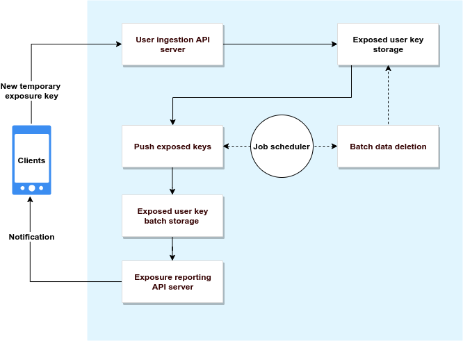

# Google Exposure Notification Server

## Functional requirements

This documents the functional requirements for building a decentralized exposure
notification system. For deployment stratgies, see [Server Deployment Options](docs/server_deployment_options.md).

### System Components

The Exposure Notification Server's archicture has been split into components.
The following diagram shows the relationship between the different components:



The server components are responsible for the following functions:

* Accepting the temporary exposure keys of positively diagnosed users from
mobile devices, validating those keys via device attestation APIs, and
storing those keys in a database.

* Periodically generating incremental files for download by client
devices for performing the key matching algorithm that is run on the mobile
device. The incremental files **must be digitally signed with a private key**.
The corresponding public key is pushed to mobile device separately.

  * Recommended: You should use a content delivery network (CDN) to serve these
  files.

* Required: A database for storage of published diagnosis keys.

* Required: A key/secret management system for storage of API keys, other
authorization credentials (CDN for example), and private keys for signing
device download content.

* Recommended: Periodically deleting old temporary exposure keys. After 14
days (or configured time period) the keys can no longer be matched to devices.

* Recommended: Using a CDN to distribute the temporary exposure keys of affected
users to mobile devices.

### Publishing temporary exposure keys

When a user reports a diagnosis, it is reported using the publish API server.
In the reference server implementation, the data is encoded in JSON and sent
over HTTPS, however you can use any encoding and protocol.

A given mobile application and server pair could agree upon additional
information to be shared. The information described in this section is the
minimum required set in order to validate the uploads and to generate the
necessary client batches for ingestion into the device for key matching.

Minimum required fields, followed by a JSON example:

* `temporaryExposureKeys`
  * **Type**: Array of `ExposureKey` JSON objects (below)
  * **REQUIRED**: contain 1-14 `ExposureKey` object (an individual app/server
    could keep longer history)
  * **Description**: The verified temporary exposure keys
  * `ExposureKey` object properties
    * `key` (**REQUIRED**)
      * Type: String
      * Description: Base64 encoded temporary exposure key from the device
    * `rollingStartNumber` (**REQUIRED**)
      * Type: integer (uint32)
      * Description: Intervals are 10 minute increments since the UTC epoch
    * `rollingPeriod` (**OPTIONAL** - this may not be present for some keys)
      * Type: integer (uint32)
      * Constraints
        * Valid values are [1..144]
        * If not present, 144 is the default value (1 day of intervals)
      * Description: Number of intervals that the key is valid for
* `regions` (**REQUIRED**)
  [ISO 3166 alpha-2](https://en.wikipedia.org/wiki/ISO_3166-1_alpha-2) format.
  * Type: Array of string
  * Description: 2 letter country to identify the region(s) a key is valid for.
* `appPackageName` (**REQUIRED**)
  * Type: string
  * Constraints:
    * For Android device, this must match the device `appPackageName` in the
      SafetyNet verification payload
  * Description: name of the application bundle that sent the request.
* `platform` (**REQUIRED**)
  * Type: string
  * Description: Mobile device platform this request originated from.
* `transmissionRisk` (**REQUIRED**)
  * Type: Integer
  * **The values and meanings of this enum are not finalized at this time.** //TODO(llatif): check status
  * Constraints:
    * Valid values range from 1-9
  * Description: //TODO(llatif): Add description
* `deviceVerificationPayload` (**REQUIRED**)
  * Type: String
  * Description:  Verification payload.
    * For Android devices this is a SafetyNet device attestation in JSON Web
    Signature (JWS) format.
    * For iOS devices, this is a DeviceCheck attestation.
* `verificationPayload`
  * Type: String
  * Description: some signature / code confirming authorization by the verification authority.
* `padding`
  * Type: String
  * Constraints:
    * Recommend size is random between 1 and 2 kilobytes.
  * Description: Random data to obscure the size of the request network packet
    sniffers.

The following snippet is an example POST request payload in JSON format.

```json
{
  "temporaryTracingKeys": [
    {"key": "base64 KEY1", "rollingStartNumber": 12345, "rollingPeriod": 144},
    {"key": "base64 KEY2", "rollingStartNumber": 12489, "rollingPeriod": 10},
    {"key": "base64 KEYN", "rollingStartNumber": 12499, "rollingPeriod": 100}],
  "regions": ["US", "CA", "MX"],
  "appPackageName": "com.foo.app",
  "platform": "android",
  "diagnosisStatus": 2,
  "deviceVerificationPayload": "base64 encoded attestation payload string",
  "verificationPayload": "signature /code from  of verifying authority",
  "padding": "random string data..."
}
```

### Requirements and recommendations

* Required: A whitelist check for `appPackageName` and the regions in
which the app is allowed to report on.

* Required: Android device verification. The SafetyNet device attestation API
can be used to confirm a genuine Android device. For more information on
SafetyNet, see the
[SafetyNet Attestation API](https://developer.android.com/training/safetynet/attestation).

  * Having `temporaryTracingKeys` and `regions` be part of the device
  attestation will allow only data used to verify the device to be uploaded.

  * For verification instructions, see [Verify the SafetyNet attestation response.](https://developer.android.com/training/safetynet/attestation#verify-attestation-response)

* Required: iOS device verification. You can use the `DeviceCheck` API can be
used to confirm a genuine iOS device. For more
information, see the
[DeviceCheck overview](https://developer.apple.com/documentation/devicecheck).

  * For verification instructions, see
  [Communicate with APNs using authentication tokens](https://help.apple.com/developer-account/#/deva05921840)

* Recommended: The `transaction_id` in the payload should be the SHA256 hash of
the concatenation of:

  * `appPackageName`

  * Concatenation of the `TrackingKey.Key` values in their base64 encoding,
  sorted lexicographically

  * Concatenation of regions, uppercased, sorted lexicographically

* Recommended: To discourage abuse, only failures in processing should
return retry-able error codes to clients. For example, invalid device
attestations should return success, with the data only saved for abuse
analysis.

* Appropriate denial of service protection should be put in place.

### Batch creation and publishing

You should schedule a script that generates files for download over the HTTPS
protocol to client devices. The generation of these files are a regular and
frequent operation (at least once a day per device), we recommend that you
generate the files in a single operation rather than on-demand, and distribute
the files using a CDN.

For information on the format of the batch file, see
[Exposure Key Export File Format and Verification](https://www.google.com/covid19/exposurenotifications/pdfs/Exposure-Key-File-Format-and-Verification.pdf).

The batch file generation should be per-region, incremental feeds of new data.
While additional data can be included in the downloads, there is a minimum set
that is required by the exposure notification API, which is relayed from
affected users in an unmodified form.

The device operating system and libraries will use the known public key to verify
an attached data signature before loading the data. To make the data verifiable:

* The data must be signed with the private key of the server.

* The public key for the server will be distributed by Apple and Google to
devices along with a list containing the countries for which the server
can provide data to.

* Export files must be signed using the ECDSA on the P-256 Curve with a
SHA-256 digest.

**Important: The matching algorithm only runs on data that has been verified
with the public key distributed by the device configuration mechanism.**

The app on the device must know which files to download. We recommend that
a consistent index file is used so that a client would download that index file
to discover any new, unprocessed batches.

If you are using a CDN to distribute these files, ensure that the cache
control expiration is set so that the file is refreshed frequently for distribution.

### Managing secrets

The use of a secure secret manager (for example,
[Hashicorp](https://www.hashicorp.com/),
[Key Vault](https://azure.microsoft.com/en-us/services/key-vault/),
[Cloud Secret](https://cloud.google.com/secret-manager)) or a hardened
on-premises equivalent is required to store the following data:

* API keys
  * Android SafetyNet API key
  * API keys and credentials needed for publication to the CDN

* Private signing key
  * The private key for signing the client download files

### Data Deletion

Since devices will only be retaining the temporary exposure keys for a limited
time (a configurable number of days), we recommend:

* Dropping keys from the database on a similar schedule as they would be dropped
from devices.

* Removing obsolete files from the CDN.

* If used, the index file on the CDN should be updated to no longer point to
deleted files.

You should design your database to accommodate bulk deletion due to abuse,
broken apps, human error, or incorrect lab results.
