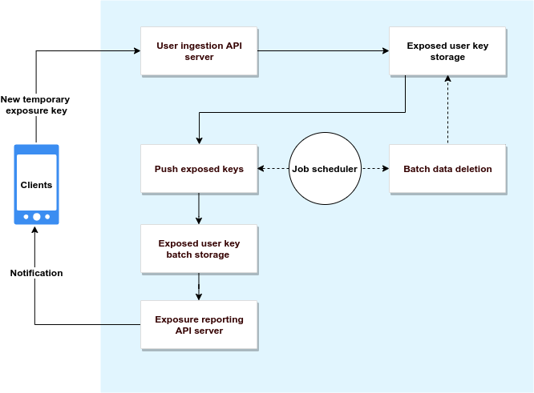

# Google Exposure Notification Key Server

## Functional requirements

This documents the functional requirements for building a decentralized exposure
notification system. For deployment strategies, see [Server Deployment Options](server_deployment_options.md).

### System Components

The Exposure Notification Key Server's architecture has been split into components.
The following diagram shows the relationship between the different components:



The server components are responsible for the following functions:

* Accepting the temporary exposure keys of positively diagnosed users from
mobile devices, validating those keys via configured public health authority
_diagnosis verification servers_.

* Periodically generating incremental files for download by client
devices for performing the key matching algorithm that is run on the mobile
device. The incremental files **must be digitally signed with a private key**.
The corresponding public key is pushed to mobile device separately.

  * Recommended: You should use a content delivery network (CDN) to serve these
  files.

* Required: A database for storage of published diagnosis keys.

* Required: A key/secret management system for storage of API keys, other
authorization credentials (CDN for example), and private keys for signing
device download content.

* Recommended: Periodically deleting old temporary exposure keys. After 14
days (or configured time period) the keys can no longer be matched to devices.
_Please seek legal counsel about data retention policies in your locale._

* Recommended: Using a CDN to distribute the temporary exposure keys of affected
users to mobile devices.

### Publishing temporary exposure keys

Before reporting temporary exposure keys to the exposure notifications key server,
a diagnosis must first verified by a _diagnosis verification server_. The
diagnosis verification server is intentionally separate from the exposure
notifications server. The verification server is run by a local government or
public health authority. The exposure notification key server is responsible for
[validating these certificates](design/verification_protocol.md).

When a user reports a diagnosis, it is reported using the publish API server.
In the reference server implementation, the data is encoded in JSON and sent
over HTTPS, however you can use any encoding and protocol. None of the data
stored in the database is personally identifiable information (PII).

A given mobile application and server pair could agree upon additional
information to be shared. The information described in this section is the
minimum required set in order to validate the uploads and to generate the
necessary client batches for ingestion into the device for key matching.

We have provides a sample API in [exposure_types.go](https://github.com/google/exposure-notifications-server/blob/main/pkg/api/v1alpha1/exposure_types.go).

Minimum required fields, followed by a JSON example:

* `temporaryExposureKeys`
  * **Type**: Array of `ExposureKey` JSON objects (below)
  * **REQUIRED**: contain 1-14 `ExposureKey` object (an individual app/server
    could keep longer history)
  * **Description**: The verified temporary exposure keys
  * `ExposureKey` object properties
    * `key` (**REQUIRED**)
      * Type: String
      * Description: Base64 encoded temporary exposure key from the device
    * `rollingStartNumber` (**REQUIRED**)
      * Type: integer (uint32)
      * Description: Intervals are 10 minute increments since the UTC epoch
    * `rollingPeriod` (**OPTIONAL** - this may not be present for some keys)
      * Type: integer (uint32)
      * Constraints
        * Valid values are [1..144]
        * If not present, 144 is the default value (1 day of intervals)
      * Description: Number of intervals that the key is valid for
    * `transmissionRisk` (**REQUIRED**)
      * Type: Integer
      * **The values and meanings of this enum are not finalized at this time.** //TODO(llatif): check status
      * Constraints:
        * Valid values range from 0-8
      * Description: //TODO(llatif): Add description
* `regions` (**REQUIRED**)
  [ISO 3166 alpha-2](https://en.wikipedia.org/wiki/ISO_3166-1_alpha-2) format.
  * Type: Array of string
  * Description: 2 letter country to identify the region(s) a key is valid for.
* `appPackageName` (**REQUIRED**)
  * Type: string (lowercase)
  * Description: Name of the application being used to send the request. This
    is used to determine what app is uploading keys and if it is an allowed
    region for that app. (BundleID on iOS)
* `verificationPayload` (**REQUIRED FOR VERIFICATION PROTOCOL**)
  * Type: String
  * Description: verificationPayload is a signed certificate from a public
    health authority, indicating a confirmed diagnosis
* `hmackey` (**REQUIRED FOR VERIFICATION PROTOCOL**)
  * Type: String
  * Description: The device generated, random key that was used to create the
  HMAC for the data sent to the diagnosis verification server. The actual
  data to calculate the HMAC over is defined as part of the
  [verification protocol](design/verification_protocol.md). This field is base64
  encoded.
* `padding`
  * Type: String
  * Constraints:
    * Recommend size is random between 1 and 2 kilobytes.
  * Description: Random data to obscure the size of the request network packet
    sniffers.

The following snippet is an example POST request payload in JSON format.

```json
{
  "temporaryExposureKeys": [
    {"key": "base64 KEY1", "rollingStartNumber": 12345, "rollingPeriod": 144, "transmissionRisk": 5},
    {"key": "base64 KEY2", "rollingStartNumber": 12489, "rollingPeriod": 10, "transmissionRisk": 6},
    {"key": "base64 KEYN", "rollingStartNumber": 12499, "rollingPeriod": 100, "transmissionRisk": 7}],
  "regions": ["US", "CA", "MX"],
  "appPackageName": "com.foo.app",
  "verificationPayload": "signed JWT issued by public health authority",
  "hmackey": "base64 encoded HMAC key used in preparing the data for the verification server",
  "padding": "random string data..."
}
```

### Requirements and recommendations

* Required: An allow-list check for `appPackageName` and the regions in
which the app is allowed to report on. Individual applications should also be
configured for one or more public health authorities they at they accept
diagnosis verifications from.

* Recommended: To discourage abuse, only failures in processing should
return retry-able error codes to clients. For example, invalid device
attestations should return success, with the data only saved for abuse
analysis.

* Appropriate denial of service protection should be put in place.

* Recommended: Our overall security and privacy recommendation is to, from
  the mobile application, periodically send chaff requests to the sever so that
  ALL users appear to be reporting themselves as infected multiple times per
  day. These requests will be rejected if they contain an invalid or unsigned
  JWT in the `verificationPayload` field.

### Batch creation and publishing

You should schedule a script that generates files for download over the HTTPS
protocol to client devices. The generation of these files are a regular and
frequent operation (batches should be generated at least once a day), we recommend that you
generate the files in a single operation rather than on-demand, and distribute
the files using a CDN.

For information on the format of the batch file, see
[Exposure Key Export File Format and Verification](https://developers.google.com/android/exposure-notifications/exposure-key-file-format)
and [Working with Export Files](https://github.com/google/exposure-notifications-server/tree/main/examples/export).

The batch file generation should be per-region, incremental feeds of new data.
While additional data can be included in the downloads, there is a minimum set
that is required by the exposure notification API, which is relayed from
affected users in an unmodified form.

The device operating system and libraries will use the known public key to verify
an attached data signature before loading the data. To make the data verifiable:

* The data must be signed with the private key of the server.

* The public key for the server will be distributed by Apple and Google to
devices along with a list containing the countries for which the server
can provide data to.

* Export files must be signed using the ECDSA on the P-256 Curve with a
SHA-256 digest.

**Important: The matching algorithm only runs on data that has been verified
with the public key distributed by the device configuration mechanism.**

The app on the device must know which files to download. We recommend that
a consistent index file is used so that a client would download that index file
to discover any new, unprocessed batches.

If you are using a CDN to distribute these files, ensure that the cache
control expiration is set so that the file is refreshed frequently for distribution.

### Managing secrets

The use of a secure secret manager (for example,
[Hashicorp](https://www.hashicorp.com/),
[Key Vault](https://azure.microsoft.com/en-us/services/key-vault/),
[Cloud Secret](https://cloud.google.com/secret-manager)) or a hardened
on-premises equivalent is required to store the following data:

* Private signing key
  * The private key for signing the client download files

### Data Deletion

Since devices will only be retaining the temporary exposure keys for a limited
time (a configurable number of days), we recommend:

* Dropping keys from the database on a similar schedule as they would be dropped
from devices.

* Removing obsolete files from the CDN.

* If used, the index file on the CDN should be updated to no longer point to
deleted files.

You should design your database to accommodate bulk deletion due to abuse,
broken apps, human error, or incorrect lab results.
